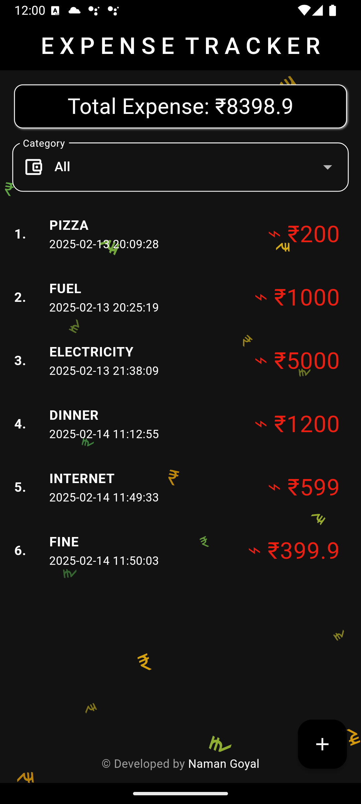
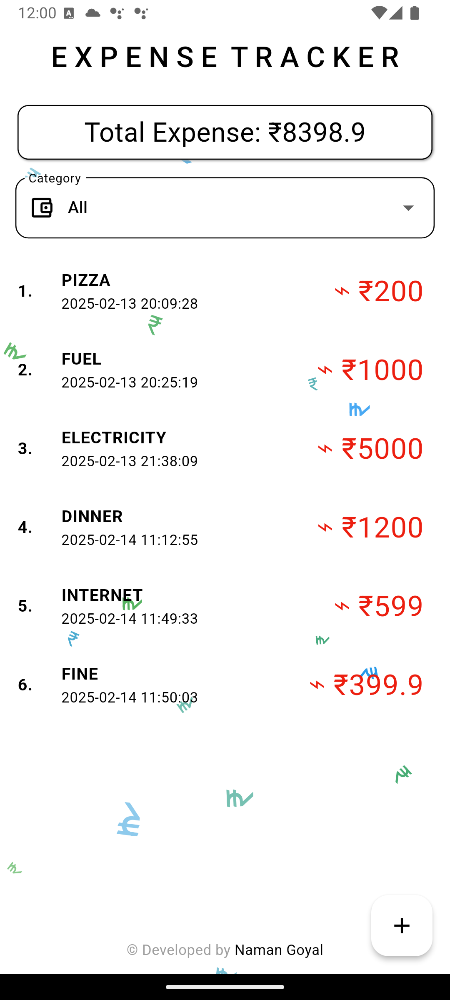

# Expense Tracker App

This Flutter app helps you easily track your expenses. Developed by me, Naman Goyal, for the CodeChef club, it's designed for simplicity and efficiency.

## Features

- **Add Expenses:** Quickly input expenses with name, amount, and category.
- **Categorize:** Organize expenses by category (Food, Transport, Bills, etc.).
- **View Expenses:** See all expenses or filter by category.
- **Total Expense:** Instantly view your total spending.
- **Local Storage:** Expenses are saved locally using shared preferences.
- **Budget Tracking:** Set a monthly budget and get alerts if you exceed it.
- **Clean UI:** Intuitive and user-friendly interface.
- **Theme**: Both dark and light theme avialable.

## Tech Stack

- Flutter
- Bloc (State Management)
- Shared Preferences (Local Storage)

## File Structure

```
lib/
├── app.dart
├── common/
│   └── config/
│   └── widgets/
│       ├── index.dart
|       └── text_fields.dart
├── core/
│   └── config/
│       └── theme/
│           └── app_colors.dart
├── features/
│   └── expense_page/
│       ├── domain/
│       │   └── entities/
│       │       └── expense_m.dart
│       ├── presentation/
│       │   ├── cubit/
│       │   │   └── expense_cubit.dart
│       │   ├── pages/
│       │   │   ├── components/
│       │   │   │   └── add_expense.dart
│       │   │   └── home_page.dart
└── main.dart
```

## Code Highlights

- **main.dart:** Initializes Flutter and shared preferences.
- **app.dart:** Sets up the root widget and Bloc provider.
- **home_page.dart:** Displays expenses, total expense, and category dropdown. Handles expense deletion via dismissible list items. Uses a `BlocBuilder` to react to state changes and update the UI.
- **expense_cubit.dart:** Manages expense state using the Bloc pattern. Includes methods to add, remove, load, and save expenses. Implements budget checking logic. Emits states to trigger UI updates. Handles errors using `onError`.
- **add_expense.dart:** Dialog for adding new expenses, including input fields and category selection. Interacts with the `ExpenseCubit` to add new expenses.
- **expense_m.dart:** Defines the `Expense` entity with properties like name, date, price, and category. Includes methods for JSON serialization and deserialization.

## How to Run

1. Clone the repository.
2. Install dependencies: `flutter pub get`
3. Run the app: `flutter run`

## Key Improvements & Design Decisions

- **Bloc Pattern:** I chose the Bloc pattern for state management to ensure a clear separation of concerns and make the app more testable and maintainable.
- **Shared Preferences:** Used shared preferences for local storage due to its simplicity for this use case. For larger datasets, a local database would be more appropriate.
- **Error Handling:** Implemented basic error handling in the `ExpenseCubit` using the `onError` method. This allows the app to gracefully handle issues like invalid input.
- **UI/UX:** Focused on a clean and intuitive user interface to make the app easy to use.



This project demonstrates my understanding of Flutter, state management, and data persistence. I'm eager to discuss it further during the CodeChef interview.

I also have an app published on playstore and I would like to show you guys.
